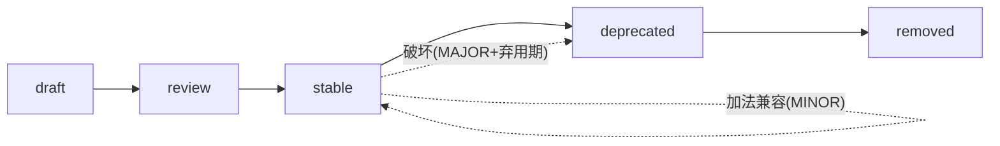
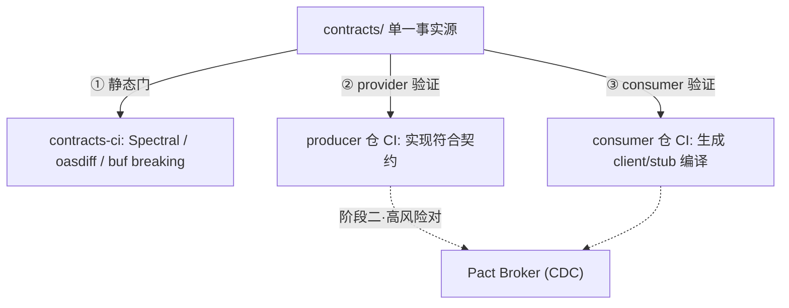

# 06 · 契约治理与契约测试

> 本篇定义跨子系统的**接口契约治理**：契约作为子系统**独立迭代的边界**，如何制定、版本演进、测试，保证「各分系统独立开发/发版而互不破坏」。决策摘要见 [架构 README · AD-17](./README.md)。
> 占位均脱敏（`acme` / `tenant-demo` / `example.com`），不含任何甲方信息。

## 1. 为什么需要契约治理

平台是**多服务 + 多语言 + git submodule 粗粒度**架构（Java / APISIX-Lua / TS / Python，约 8 仓独立开发独立发版）。子系统间的耦合点（REST / 异步事件 / RPC / 跨切面线契约）若无统一治理，会出现：改一处悄悄破坏下游、各仓各写一套错误结构、联调期才发现不兼容。

**核心原则：契约是子系统的边界与事实源——先改契约、再改实现。** 契约集中在主仓 `contracts/`（呼应架构 04「ICD 统一放主仓」），各仓**经契约**对接，而非经彼此源码。

## 2. 契约类型与格式

| 类型 | 场景 | 格式 | 工具门 |
|--|--|--|--|
| REST | 南北向（前端/外部）+ 东西向（服务间同步调用） | **OpenAPI 3.1** | Spectral · oasdiff |
| 异步事件 | Kafka 领域事件、变更通知 | **AsyncAPI 2.6 + JSON Schema** | Spectral · schema 兼容 |
| RPC | 内部 gRPC | **protobuf** | buf lint · buf breaking |
| 线契约 | 跨切面 HTTP 约定（租户头、错误信封…），非单服务 | **ICD(Markdown)(+schema)** | 评审 + 示例 |

> 首个线契约范例：[租户上下文头 `X-Tenant-*`](../../contracts/icd/tenant-context-headers-icd.md)（gateway 注入 ↔ `starter-tenant` 消费）。

## 3. 契约生命周期

```text
  draft ──→ review ──→ stable ──→ deprecated ──→ (移除)
  征求意见   接口冻结    生产承诺    弃用期双跑      过窗口删除
            待确认      破坏须走     给移除日期
                       弃用流程
```



## 4. 版本与兼容（独立迭代的核心机制）

契约走 **semver**，与实现/制品版本**解耦**：

- **加法兼容默认放行**（MINOR）：新增可选字段 / 端点 / 事件类型 / 放宽校验。消费方一律 **tolerant reader**。
- **破坏性变更**（MAJOR）必须：弃用期**双跑**（producer 同时支持新旧）+ 标注移除日期 + **通知全部 consumers**。REST 走 `/v2`、事件 envelope `schemaVersion`、proto package `v2`。
- CI 对**基线分支**做破坏性 diff（oasdiff / buf breaking）：检出破坏即 fail，除非 PR 显式声明 major bump。

> 这套「加法兼容 + 破坏走双跑弃用 + 自动破坏检测」是子系统能各自演进而不连坐的关键。

## 5. 契约测试架构（两阶段）

**决策：先 schema-first 立即落地，CDC 按需演进**（schema-first 覆盖率高、零额外基础设施；CDC 捕获运行期消费者期望但需 broker）。

```text
        contracts/ (单一事实源)
            │  ① 静态门 (主仓 contracts-ci)
            │     Spectral lint · oasdiff/buf breaking
   ┌────────┴─────────┐
   ▼                  ▼
producer 仓 CI      consumer 仓 CI
② 实现符合契约      ③ 据契约生成 client/stub
 (schemathesis/      并编译/验证
  openapi-validator)  (openapi-generator/buf generate)
            │
            ▼ (阶段二·高风险对)
        CDC / Pact Broker  ── consumer 声明期望 → producer can-i-deploy
```



- **阶段一（现行）**：① 主仓静态门（lint + 破坏性检测）；② producer 仓验证实现符合契约；③ consumer 仓据契约生成代码、编译期锁字段（契约破坏 → 消费方构建失败）。
- **阶段二（演进）**：对跨团队高频协作 / 出过兼容事故的 producer↔consumer 对，引入 **Pact**（polyglot，Java/TS/Python 全覆盖），broker 纳入 CI 基础设施。

## 6. 归属与流程

- **集中**：契约在主仓 `contracts/`（单一事实源）；schema 契约可被各仓生成代码消费。CDC 的 pact 由各 consumer 仓产生、broker 托管。
- **评审门**：`contracts/**` 变更需 CODEOWNERS 评审（兼容级别、consumer 知会、脱敏、registry 登记）。
- **流程**：契约 PR → 静态门 + 评审 → 合并 → 各仓据契约测试 → 发契约版本。**实现跟随已合并契约，不反向**。

## 7. 决策记录

| # | 决策 | 选定 | 理由 |
|--|--|--|--|
| C1 | 契约归属 | **集中主仓 `contracts/`** 单一事实源 | 呼应架构 04；跨仓对接经契约非源码 |
| C2 | REST / 事件 / RPC 格式 | OpenAPI 3.1 / AsyncAPI+JSON Schema / protobuf | 业界标准，工具链成熟 |
| C3 | 兼容策略 | 加法兼容默认 + 破坏走 MAJOR+双跑弃用 + 自动破坏检测 | 子系统独立迭代不连坐 |
| C4 | 契约测试 | **两阶段：schema-first → CDC(Pact)** | 立即低成本落地；高风险对再上 CDC |
| C5 | 静态门工具 | Spectral · oasdiff · buf | 覆盖三类格式的 lint 与破坏检测 |
